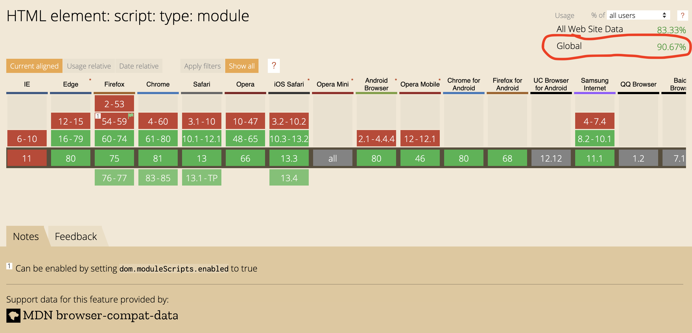
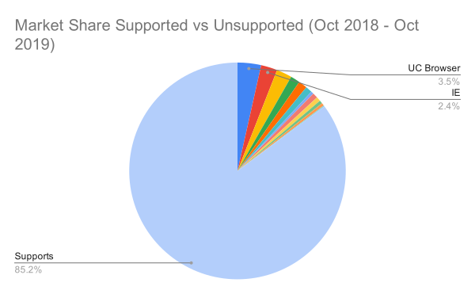
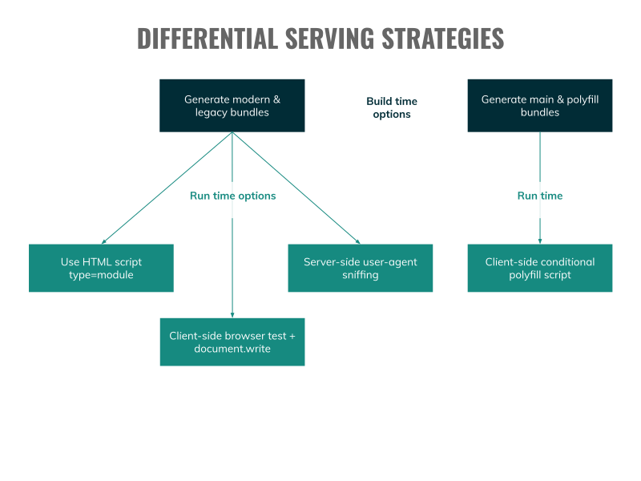
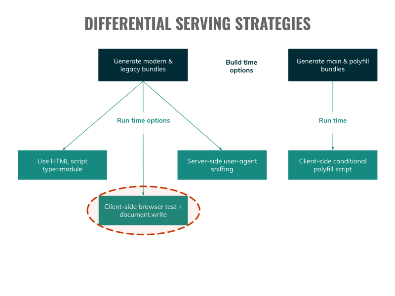
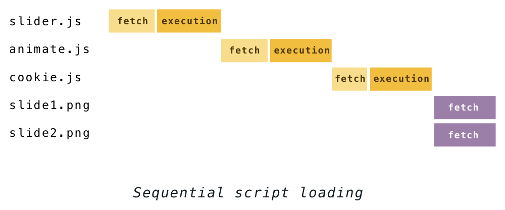
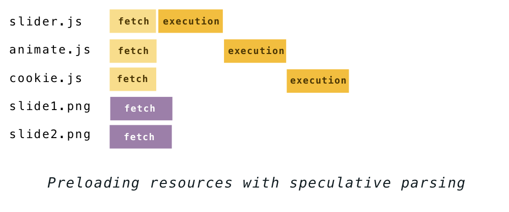
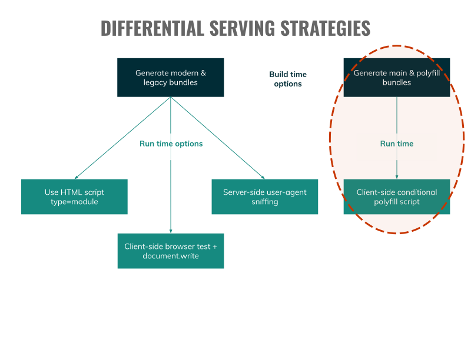
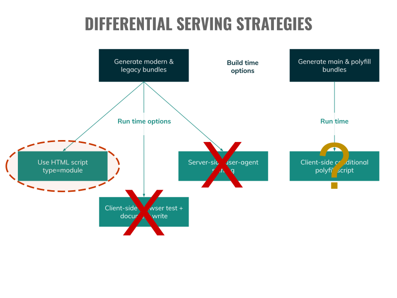
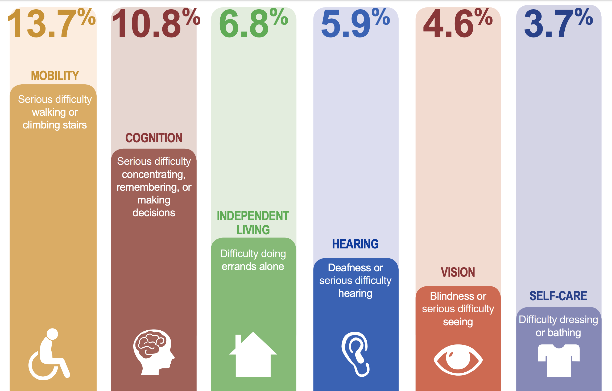

<!-- .slide: data-background="./images/vintage-suitcases.jpg" -->
<h1 class="title dark-background"><span class="highlighter">Vintage Bundles</span></h1>
<h2 class="subtitle dark-background"><span class="highlighter">Sia Karamalegos</span></h2>

Note: Photo by Erwan Hesry on Unsplash https://unsplash.com/photos/Q34YB7yjAxA

---

## hi, i'm sia

⚡ 👩🏻‍💻 🇬🇷 🐶 🐺 🎨 📓 ✈️


---

## Resources for this talk

[bit.ly/vintagebundles](http://bit.ly/vintagebundles)

---

<!-- .slide: data-background="./images/vote_1200.jpg" -->
<h1 class="dark-background"><span class="highlighter">Who uses ES6+ features?</span></h1>

Note: arrow functions, modules, async/await

---

<!-- .slide: data-background="./images/vote_1200.jpg" -->
<h1 class="dark-background"><span class="highlighter">Who transpiles ES6+ to ES5?</span></h1>

---

## Let's take a peek into transpiling...

[babeljs.io/repl](https://babeljs.io/repl)

<small>[Character counter](https://wordcounter.net/character-count)</small>

Note: Copy-paste a React element, explain that Babel inside webpack build will transpile all your JS for you. Ask what they notice, then count characters

---

<!-- .slide: data-background="./images/vote_1200.jpg" -->
<h1 class="dark-background"><span class="highlighter">What percentage of browsers don't support ES6?</span></h1>

Note: How would we check this?

---

**The HTML `<script>` tag accepts helpful attributes:**

- `type=module` - this is ES6+ code (and is automatically deferred)
- `nomodule` - don't execute in browsers that support ES6 modules

<small>[`<script>`: The Script element](https://developer.mozilla.org/en-US/docs/Web/HTML/Element/script) on MDN</small>

---

## `<script type=module>`<br> also includes support for...

- modules
- async/await
- Classes
- arrow functions
- fetch
- Promises
- Map, Set, and more!

<small>[Deploying ES2015+ Code in Production Today](https://philipwalton.com/articles/deploying-es2015-code-in-production-today/)<small>

Note: Browsers that support type=module also support these other ES6 features

---

## ~2017 major browsers started supporting `<script type=module>`

<table class="table-no-borders">
  <tbody>
    <tr>
      <td>
        <br>
        Safari 10.1*
        <br><small><em>Mar 2017</em></small>
      </td>
      <td>
        <br>
        Chrome 61
        <br><small><em>Sep 2017</em></small>
      </td>
      <td>
        <br>
        Firefox 60
        <br><small><em>May 2018</em></small>
      </td>
      <td>
        <br>
        Edge 16
        <br><small><em>Oct 2017</em></small>
      </td>
    </tr>
  </tbody>
</table>

<small>* Needs a `nomodule` workaround <p>[caniuse for `type=module`](https://caniuse.com/#feat=mdn-html_elements_script_type_module)</p></small>

Note: was available in Firefox behind a flag in June 2017

---

`<script type=module>`



<small>[caniuse for `type=module`](https://caniuse.com/#feat=mdn-html_elements_script_type_module)</small>

---



<small>[statcounter GlobalStats Browser Version Market Share Worldwide](https://gs.statcounter.com/browser-version-market-share#monthly-201810-201910-bar)</small>

---

# Impact

---

## Smaller size due to:

- reduced number of polyfills
- more efficient JS (less code)

---

## Size Impact

<table style="font-size:0.6em;">
  <thead>
    <tr>
      <th>Site/App</th>
      <th>ES2015+ / ES5 size <br /><small>(minified)</small></th>
      <th>ES2015+ / ES5 size <br /><small>(minified + gzipped)</small></th>
      <th>Size savings</th>
    </tr>
  </thead>
  <tbody>
    <tr>
      <td>philipwalton.com</td>
      <td>80K / 175K</td>
      <td>21K / 43K</td>
      <td>51-54%</td>
    </tr>
    <tr>
      <td>jeremy.codes</td>
      <td>34K / 112K</td>
      <td>13K / 39K</td>
      <td>66-70%</td>
    </tr>
    <tr>
      <td>TodoMVC</td>
      <td>8.4K / 11K</td>
      <td></td>
      <td>24%</td>
    </tr>
  </tbody>
</table>

<small>[Deploying ES2015+ Code in Production Today](https://philipwalton.com/articles/deploying-es2015-code-in-production-today/), [Doing Differential Serving in 2019](https://calendar.perfplanet.com/2018/doing-differential-serving-in-2019/), [Smart Bundling: How To Serve Legacy Code Only To Legacy Browsers](https://www.smashingmagazine.com/2018/10/smart-bundling-legacy-code-browsers/)<small>

---

## Time Impact

Smaller size = Reduced load, parse, & eval time

<table class="fragment fade-in-then-semi-out" style="font-size:0.6em;">
  <thead>
    <tr>
      <th>Site/App</th>
      <th>ES2015+ / ES5 size <br /><small>(minified)</small></th>
      <th>ES2015+ / ES5 size <br /><small>(minified + gzipped)</small></th>
      <th>Size savings</th>
      <th>ES2015+ / ES5 parse/eval time (avg)</th>
      <th>Parse/eval time savings</th>
    </tr>
  </thead>
  <tbody>
    <tr>
      <td>philipwalton.com</td>
      <td>80K / 175K</td>
      <td>21K / 43K</td>
      <td>51-54%</td>
      <td>172ms / 367ms</td>
      <td>53%</td>
    </tr>
    <tr>
      <td>jeremy.codes</td>
      <td>34K / 112K</td>
      <td>13K / 39K</td>
      <td>66-70%</td>
      <td>165ms / 466ms</td>
      <td>65%</td>
    </tr>
    <tr>
      <td>TodoMVC</td>
      <td>8.4K / 11K</td>
      <td></td>
      <td>24%</td>
      <td></td>
      <td></td>
    </tr>
  </tbody>
</table>

<small>[Deploying ES2015+ Code in Production Today](https://philipwalton.com/articles/deploying-es2015-code-in-production-today/), [Doing Differential Serving in 2019](https://calendar.perfplanet.com/2018/doing-differential-serving-in-2019/), [Smart Bundling: How To Serve Legacy Code Only To Legacy Browsers](https://www.smashingmagazine.com/2018/10/smart-bundling-legacy-code-browsers/)<small>

---

<h1 id="loading">Why do we care about size and time?</h1>

---

> 53% of mobile sites are abandoned if pages take longer than 3 seconds to load.

<small>2016 report by Doubleclick by Google</small>

---

> Pinterest reduced load times by 40% and saw a 15% increase in sign ups.

<small>https://wpostats.com/</small>

---

> Starbucks implemented a 2x faster time to interactive resulting in a 65% increase in rewards registrations.

<small>[Get Down to Business: Why the Web Matters (Chrome Dev Summit 2018)](https://www.youtube.com/watch?v=Xryhxi45Q5M&t=1113s&index=6&list=PLNYkxOF6rcIDjlCx1PcphPpmf43aKOAdF )</small>

---

> Speed is now used as a ranking factor for mobile searches.

<small>https://developers.google.com/web/updates/2018/07/search-ads-speed</small>

---

The internet consumes 416.2 TWh of electricity per year. A 10% savings would be equivalent to:

- 6.2 million fewer cars on the road <!-- .element: class="fragment fade-in-then-semi-out" -->
- 32 billion less pounds of coal being burned <!-- .element: class="fragment fade-in-then-semi-out" -->
- 486 million tree seedlings grown for 10 years <!-- .element: class="fragment fade-in-then-semi-out" -->

<small>[How is your website impacting the planet?](https://www.websitecarbon.com/), [Greenhouse Gas Equivalencies Calculator](https://www.epa.gov/energy/greenhouse-gas-equivalencies-calculator)</small>

Note: Most of the energy is consumed by the network and data center, not users' devices.

---

# How do we balance speed and support?

---

**Differential serving** is the concept of serving modern, ES6+ code to modern browsers and legacy, transpiled code to legacy browsers.

---



---


---

```html
<!-- Browsers with ES module support load this file. -->
<script type="module" src="/modern.js"></script>

<!-- Older browsers load this file (and module-supporting -->
<!-- ones do not***). -->
<script nomodule src="/legacy.js" defer></script>
```

---

## *** Oops

- ✅ no browser executes twice (with the Safari hack) <!-- .element: class="fragment fade-in-then-semi-out" -->
- ✅ modern Chrome and Firefox only fetch once <!-- .element: class="fragment fade-in-then-semi-out" -->
- ⚠️ Safari <11 may or may not double fetch (unclear trigger) <!-- .element: class="fragment fade-in-then-semi-out" -->
- ⚠️ Safari 11+ may still double fetch in some cases (see bug) <!-- .element: class="fragment fade-in-then-semi-out" -->
- ❌ pre-2018 browsers do double fetches <!-- .element: class="fragment fade-in-then-semi-out" -->
- ❌❌ latest Edge does triple fetch (2x module + 1x nomodule) <!-- .element: class="fragment fade-in-then-semi-out" -->

<small>From [Will it double-fetch? Browser behavior with `module` / `nomodule` scripts](https://gist.github.com/jakub-g/5fc11af85a061ca29cc84892f1059fec) by jakub-g
  <br>[Safari hack](https://gist.github.com/samthor/64b114e4a4f539915a95b91ffd340acc), [Safari bug](https://bugs.webkit.org/show_bug.cgi?id=194337)</small>

---



---

```html
<script>
  var MODERN_BUNDLE = "assets/dist/js/scripts.modern.min.js";
  var LEGACY_BUNDLE = "assets/dist/js/scripts.min.js";

  function isModern() {
    try {
      new Function('import("")');
      return true;
    } catch (err) {
      return false;
    }
  }

  var scriptTag = document.createElement("script");
  scriptTag.setAttribute("src", isModern() ? MODERN_BUNDLE : LEGACY_BUNDLE);
  document.body.appendChild(scriptTag);
</script>
```

<small>Example code from [Should We All Start Implementing Differential Serving?](https://macarthur.me/posts/should-we-implement-differential-serving) by Alex MacArthur</small>

---

## What's wrong with this approach?

❌ Big latency performance penalty from breaking <br>**speculative parsing / preload scanning**

---

Say we have some HTML like this:

```html
<script src="slider.js"></script>
<script src="animate.js"></script>
<script src="cookie.js"></script>


```

<small>[Building the DOM faster: speculative parsing, async, defer and preload](https://hacks.mozilla.org/2017/09/building-the-dom-faster-speculative-parsing-async-defer-and-preload/) by Milica Mihajlija</small>

---

## Pre-2008 HTML Parsing



<small>[Building the DOM faster: speculative parsing, async, defer and preload](https://hacks.mozilla.org/2017/09/building-the-dom-faster-speculative-parsing-async-defer-and-preload/) by Milica Mihajlija</small>

---

## Modern HTML Parsing



<small>[Building the DOM faster: speculative parsing, async, defer and preload](https://hacks.mozilla.org/2017/09/building-the-dom-faster-speculative-parsing-async-defer-and-preload/) by Milica Mihajlija</small>

Note: "[Modern browsers] “speculatively” discover assets that will eventually be needed and start loading them in the background. So, embedded scripts have a huge leg up vs. those loaded by JS, which first have to wait for their time to come in the DOM-building process before they can even start downloading"

---


---

## What's wrong with user-agent sniffing?

- ❌ Not trivial and prone to false classification
- ❌ New User Agent strings are added daily
- ❌ Can't be used for static deployments
- ❌ Bad for caching
- ❌ [Mozilla will smite you](https://developer.mozilla.org/en-US/docs/Web/HTTP/Browser_detection_using_the_user_agent#Considerations_before_using_browser_detection)

<small>[Modern Script Loading](https://jasonformat.com/modern-script-loading/) by Jason Miller, [Smart Bundling: How To Serve Legacy Code Only To Legacy Browsers](https://www.smashingmagazine.com/2018/10/smart-bundling-legacy-code-browsers/) by Shubham Kanodia, [Cloudfront may even remove the header](https://docs.aws.amazon.com/AmazonCloudFront/latest/DeveloperGuide/RequestAndResponseBehaviorCustomOrigin.html#request-custom-user-agent-header)</small>

---



---

```html
<!-- newer browsers won't load this bundle: -->
<script nomodule src="polyfills.js"></script>

<!-- all browsers load this one: -->
<script src="/bundle.js"></script>
```

Note: "worst-case is that the polyfills are loaded or possibly even executed (in Safari 10.1), but the effect is limited to "over-polyfilling"." Not sure how easy this would be in practice.

---



---

Problematic for Safari 10.1, modern Edge, and older versions of all:

```html
<!-- Browsers with ES module support load this file. -->
<script type="module" src="/modern.js"></script>

<!-- Older browsers load this file (and module-supporting -->
<!-- ones do not***). -->
<script nomodule src="/legacy.js" defer></script>
```

---

Problematic for ~~Safari 10.1~~, modern Edge, and older versions of all:

```html
<!-- polyfill `nomodule` in Safari 10.1: -->
<script type=module>
!function(e,t,n){!("noModule"in(t=e.createElement("script")))&&
  "onbeforeload"in t&&(n=!1,e.addEventListener("beforeload",function(e){
  if(e.target===t)n=!0;else if(!e.target.hasAttribute("nomodule")||!n)
  return;e.preventDefault()},!0),t.type="module",t.src=".",
  e.head.appendChild(t),t.remove())}(document)
</script>

<!-- Browsers with ES module support load this file. -->
<script type="module" src="/modern.js"></script>

<!-- Older browsers load this file (and module-supporting -->
<!-- ones do not***). -->
<script nomodule src="/legacy.js" defer></script>
```

---

**"Problematic"** for ~~Safari 10.1~~, modern Edge, and older versions of all:

```html
<!-- polyfill `nomodule` in Safari 10.1: -->
<script type=module>
!function(e,t,n){!("noModule"in(t=e.createElement("script")))&&
  "onbeforeload"in t&&(n=!1,e.addEventListener("beforeload",function(e){
  if(e.target===t)n=!0;else if(!e.target.hasAttribute("nomodule")||!n)
  return;e.preventDefault()},!0),t.type="module",t.src=".",
  e.head.appendChild(t),t.remove())}(document)
</script>

<!-- Browsers with ES module support load this file. -->
<script type="module" src="/modern.js"></script>

<!-- Older browsers load this file (and module-supporting -->
<!-- ones do not***). -->
<script nomodule src="/legacy.js" defer></script>
```

Note: If we consider that most of these users are on desktops, then how much of a price is it to download more bytes for these small percentage of desktop users?

---

## So how many people are using modules?

---


<small><a href="https://almanac.httparchive.org/en/2019/javascript">Web Almanac by HTTP Archive - JavaScript chapter</a></small>

---


<small>[caniuse for `type=module`](https://caniuse.com/#feat=mdn-html_elements_script_type_module)</small>

---

# 😳

Note: Raise your hand again if you're transpiling your JS to ES5 for 100% of users. Now raise your hand if you would say your website is accessible.

---

<!-- .slide: data-background="./images/gleason.jpg" -->

<h1 class="dark-background"><span class="highlighter">61 million, or 26% of adults in the U.S. live with a disability</span></h1>

<small><span class="highlighter">[Donate to Team Gleason](https://teamgleason.org/donate/)</span></small>

---



<small><a href="https://www.cdc.gov/ncbddd/disabilityandhealth/infographic-disability-impacts-all.html">CDC: Disability Impacts All of Us</a></small>

---

> The WCAG failure rate for home pages was at least 97.8%.

[The WebAIM Million: What we learned analyzing 1,000,000 web site home pages](https://webaim.org/blog/webaim-million/)

Note: Low contrast text was the most common detectable issue with an average of 36 instances of low contrasts text on each home page. One-third of all images (12.3 images per page on average) were missing alternative text. 59% of form inputs were not properly labeled.

---

<!-- .slide: data-background="./images/glasses_2500.jpg" -->

<h1 class="dark-background"><span class="highlighter">Why are we prioritizing backward compatibility over accessibility?</span></h1>


Note: Photo by Josh Calabrese on Unsplash

---

<!-- .slide: data-background="./images/hero_bg.jpg" -->
<h1 class="title dark-background">Thanks!</h1>
Resources, and more at <a href="http://bit.ly/vintagebundles" class="dark-background">bit.ly/vintagebundles</a>

---

# Hands-on walk through

Start with the `4-code-splitting` branch of [github.com/siakaramalegos/markdown-viewer](https://github.com/siakaramalegos/markdown-viewer)

---

## Generating modern + legacy bundles

- 2 different [Browserslist](https://github.com/browserslist/browserslist) configs, which feed into
- 2 different [Babel](https://babeljs.io/) configs, which feed into
- 2 different [Webpack](https://webpack.js.org/) configs

---

## What's Babel + Browserslist doing?

1. Run Bundle Analyzer on prod to see our starting bundle size. Run the coverage checker in DevTools to see some of the unused code. Much of this is polyfills.
2. Update `.babelrc` to add debug:
  ```diff
   {
    "presets": [
  -    "@babel/preset-env",
  +    [
  +      "@babel/preset-env",
  +      {
  +        "debug": true
  +      }
  +    ]
    ],
    "plugins": [
      "@babel/plugin-syntax-dynamic-import",
  ```

---

## What's Babel doing?

- Run `npm start` and look for the targets in terminal log:
  ```bash
  Using targets:
  {
    "android": "4.4.3",
    "chrome": "49",
    "edge": "17",
    "firefox": "65",
    "ie": "11",
    "ios": "10.3",
    "opera": "58",
    "safari": "5.1",
    "samsung": "4"
  }
  ```
- Notice this:
```bash
Using polyfills: No polyfills were added, since the `useBuiltIns`
option was not set.
```

<small>[`useBuiltIns` docs](https://babeljs.io/docs/en/babel-preset-env#usebuiltins)</small>

Note: The default is false so not using polyfills

---

## Add polyfills

1. Add core-js for polyfills
  ```
  $ npm install --save core-js@3.4.7
  ```
2. Add core-js to the entry point
  ```javascript
  // src/index.js
  import 'core-js';
  ```
3. Limit the polyfills to only match the targeted browsers:
  ```diff
       {
         "debug": true
  +      "useBuiltIns": "entry"
  +      "corejs": "3.4.7"
       }
  ```

---

## `"useBuiltIns": "entry"`

Our import gets replaced with imports needed for our target browsers. For example, for Chrome 71:

```javascript
// src/index.js
import 'core-js';
```

changes to:

```javascript
// src/index.js
import "core-js/modules/es.array.unscopables.flat";
import "core-js/modules/es.array.unscopables.flat-map";
import "core-js/modules/es.object.from-entries";
import "core-js/modules/web.immediate";
```

<small>[core-js](https://github.com/zloirock/core-js)</small>

Note: But what if we don't use all the features that need those polyfills?

---

## Better polyfills

1. Limit the polyfills to only match those used:
  ```diff
  -      "useBuiltIns": "entry"
  +      "useBuiltIns": "usage"
  ```
2. Remove `import 'core-js';` from **src/index.js**
3. How did the bundle change?

---

## Differential Serving: Setting up

1. Add new dependencies:
  ```bash
  npm i --save-dev webpack-merge script-ext-html-webpack-plugin
  ```
2. Create **webpack.common.js** and move most of our config there except the JS rules and the `output` property.
3. In **webpack.config.js**, import merge and common:
  ```javascript
  const merge = require('webpack-merge')
  const common = require('./webpack.common.js')
  ```
4. Merge it with our existing `output` and JS rules to make sure it works before moving forward.

---

Create a **legacy** Babel config based off of our **.babelrc**, and then delete **.babelrc**:

```javascript
// babel.legacy.js
module.exports = {
  presets: [
    [
      "@babel/preset-env",
      {
        useBuiltIns: "usage",
        corejs: "3.4.7",
      }
    ]
  ],
  plugins: [
    "@babel/plugin-syntax-dynamic-import",
    "@babel/plugin-transform-runtime"
  ]
}
```

---

Create a **modern** Babel config targeting ES modules:

```javascript
// babel.modern.js
module.exports = {
  presets: [
    [
      "@babel/preset-env",
      {
        modules: false,
        targets: { esmodules: true }
      }
    ]
  ],
    plugins: [
      "@babel/plugin-syntax-dynamic-import",
      "@babel/plugin-transform-runtime"
    ]
}
```

<small>`@babel/preset-env` docs for [`modules`](https://babeljs.io/docs/en/babel-preset-env#modules) and [`targets.esmodules`](https://babeljs.io/docs/en/babel-preset-env#targetsesmodules)</small>

Note: will ignore browser targets by default

---

Create separate webpack configs for modern and legacy in **webpack.config.js**:

```javascript
const legacyConfig = merge(common, {
  output: {
    filename: '[name].js',
    path: path.resolve('./dist')
  },
  module: {
    rules: [
      {
        test: /\.m?js$/,
        exclude: [/node_modules/],
        use: {
          loader: 'babel-loader',
          options: babelLegacy,
        }
      },
    ],
  },
  optimization: {
    minimizer: [new TerserJSPlugin({})],
  },
})
```

---

```javascript
const modernConfig = merge(common, {
  output: {
    filename: '[name].mjs',
    path: path.resolve('./dist')
  },
  module: {
    rules: [
      {
        test: /\.m?js$/,
        exclude: [/node_modules/],
        use: {
          loader: 'babel-loader',
          options: babelModern,
        }
      },
    ],
  },
  optimization: {
    minimizer: [
      new TerserJSPlugin({
        test: /\.m?js(\?.*)?$/i,
        terserOptions: {
          ecma: 6 // This can be set to 7 or 8, too.
        }
      }),
    ],
  },
})
```

---

Export them both as an array for webpack to build both:

```javascript
// webpack.config.js
module.exports = [ legacyConfig, modernConfig ]
```

---

## Tada! Oops...

Note: What is the first step run in the build process? Clean! We need to edit this so it doesn't keep deleting the first build that is run when starting the second build. One quick fix is editing the script by adding `rm -rf build &&` and deleting the clean-webpack-plugin stuff.

---

## Add the scripts to the html!

1. Manually add in our modern script at the bottom of **src/index.html**
  ```html
  <script type="module" src="main.mjs"></script>
  ```
2. Add a plugin to generate the correct script tag for our legacy script into **webpack.common.js**
  ```javascript
  const ScriptExtHtmlWebpackPlugin = require("script-ext-html-webpack-plugin");
  ```

  ```javascript
  // add to plugins array:
  new ScriptExtHtmlWebpackPlugin({
    module: /\.mjs$/,
    custom: [
      {
        test: /\.js$/,
        attribute: 'nomodule',
        value: ''
      },
    ]
  })
  ```
